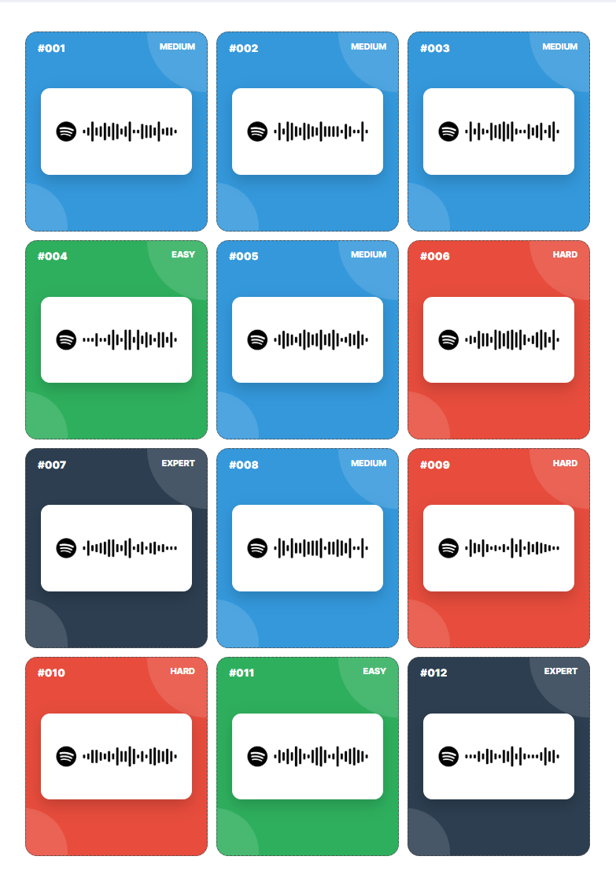
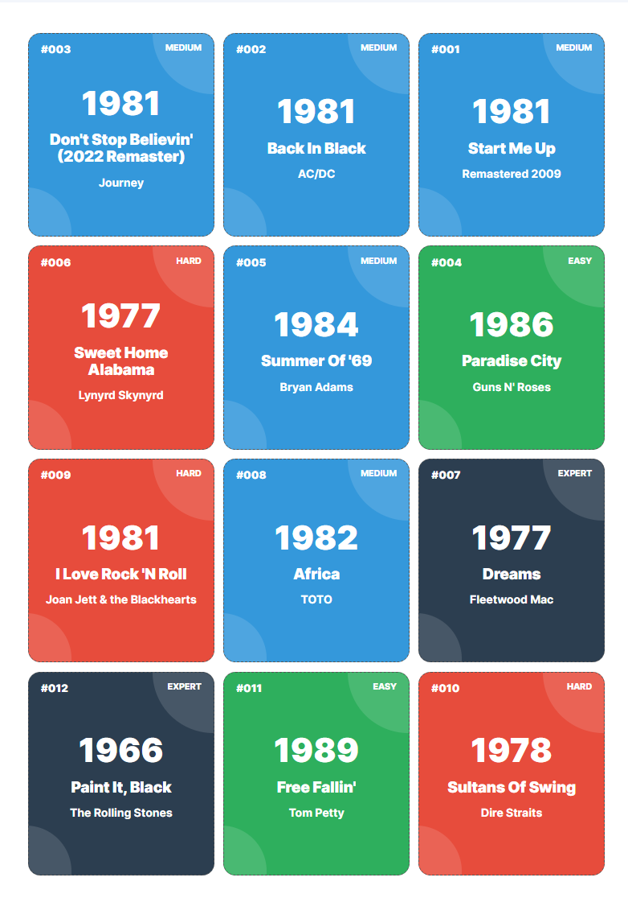
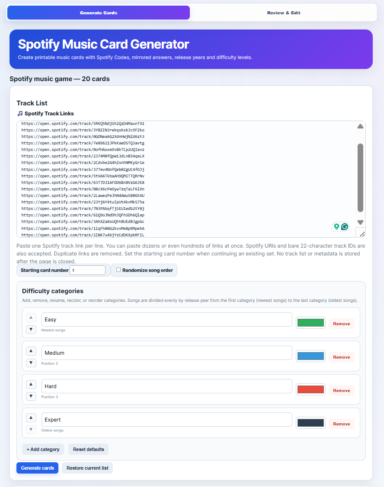
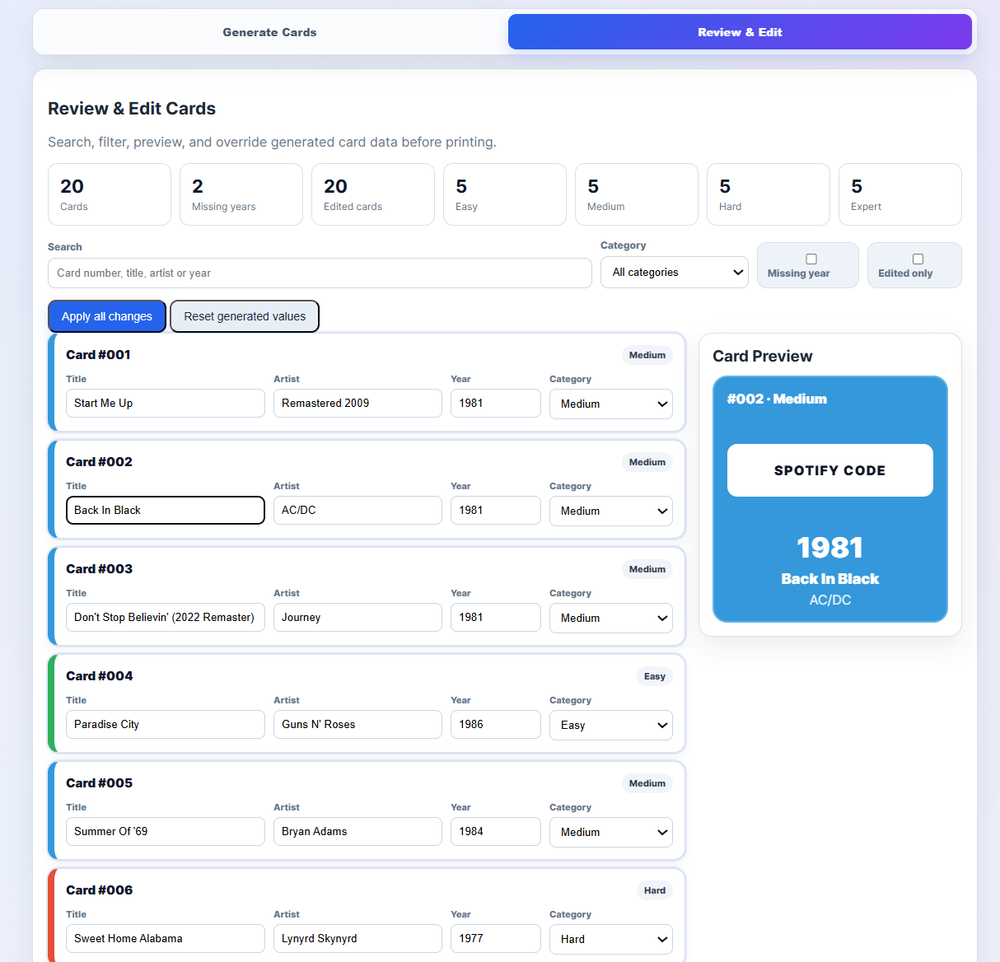

# Spotify Music Card Generator

A browser-based generator for creating **printable Spotify music cards** for quizzes.

Try it out on: https://harmhoog.github.io/SpotifyCardsGame/

Created by **Harm Hoogeveen** using **ChatGPT**.

## Features

- 🎵 Generate printable cards from Spotify track links
- 📱 Spotify Codes on every card for easy scanning
- 🗓 Automatic release year lookup with multiple fallback sources (Spotify release year is not always reliable, uses multiple sources to verify)
- 🎨 Configurable difficulty categories (add, remove, rename, recolor and reorder)
- 🔀 Optional randomization of card order
- 🔢 Configurable starting card number
- ✏️ Review & edit every generated card before printing
- 🖨 Duplex printing with matching answer backs
- 🌐 Runs completely in the browser

## How it works

1. Open the website.
2. Paste one Spotify track URL per line (you can copy a playlist in Spotify desktop app by Ctrl + A and then Ctrl + C).
3. Configure optional settings:
   - Starting card number (for if you want to add cards later)
   - Randomize order
   - Difficulty categories
4. Click **Generate Cards**.
5. Review and edit any metadata if needed.
6. Print the generated pages (fronts and backs).

## Difficulty

Songs are sorted by release year.
Newer songs are assigned to the first category while older songs are assigned to the last category (can be overriden in Review & Edit tab).
Categories are distributed as evenly as possible.

## Printing

- Print at **100% scale**.
- Enable **duplex (double-sided)** printing.
- Flip on the **long edge**.

## Screenshots

### Front of cards (Scannable spotify codes)

### Back of cards (Answer of card: year, title and artist)

### Generate Cards

### Review & Edit

## Privacy

The application runs locally in your browser.
No playlist or song list is permanently stored.

## License

Feel free to use and modify this project for personal and educational purposes.
